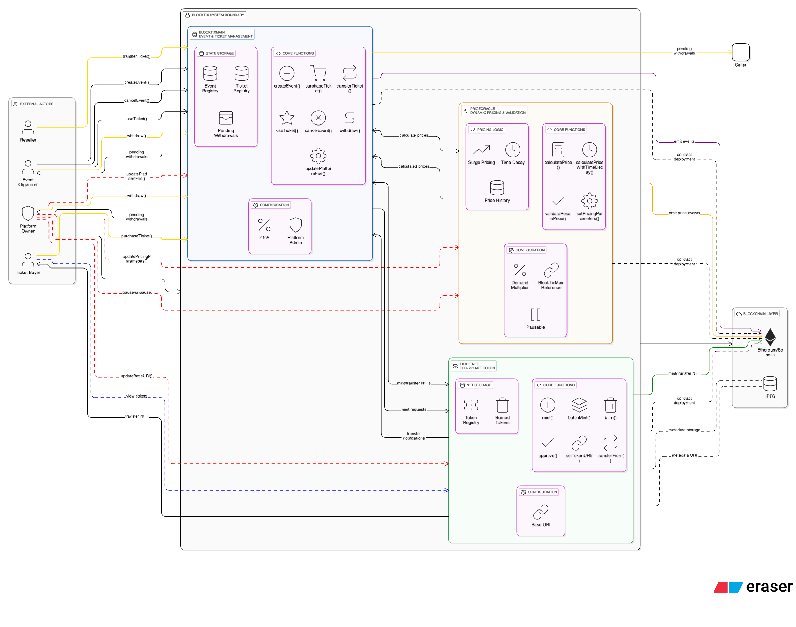
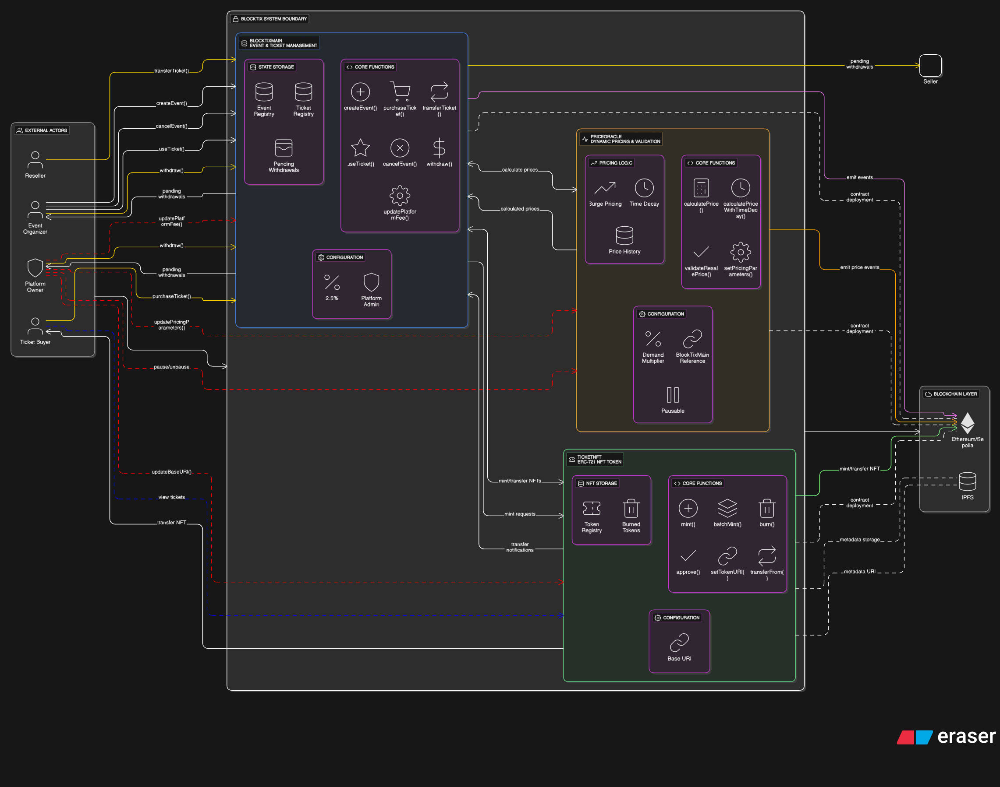

# BlockTix Architecture

## Architecture Diagrams

View the interactive architecture diagram here:
[BlockTix Architecture on Eraser.io](https://app.eraser.io/workspace/ewzr5lx263HLpQOhUUPM?origin=share&elements=ryVHPa03IQjOJaTwPehCSA)

### System Architecture Diagram 1


### System Architecture Diagram 2


---

## About This Architecture

This architecture was created using AI from [app.eraser.io](https://app.eraser.io). However, the prompt was custom made by us (the developers).

### Prompt Used

```
Create a BlockTix System Architecture based on the description below;
The BlockTix system is a decentralized event ticketing platform consisting of three main smart contracts that interact with multiple external actors. The architecture follows a modular design with clear separation of concerns.
1. HIGH-LEVEL SYSTEM ARCHITECTURE
The system layout flows from left to right with external actors outside the system boundary, including Event Organizers, Platform Owner, and Ticket Buyers. The smart contract layer sits at the center within the system boundary, containing BlockTixMain as the central hub in blue, TicketNFT for NFT management in green, and PriceOracle as the pricing engine in orange. The rightmost section shows the blockchain layer with Ethereum/Sepolia Network ports.
2. SMART CONTRACT ARCHITECTURE
BlockTixMain Contract
Positioned at the center as a large blue rounded rectangle labeled "BLOCKTIXMAIN EVENT & TICKET MANAGEMENT", this contract manages events and tickets. It contains state storage including event registry and ticket registry as database icons, plus pending withdrawals. Core functions displayed include createEvent, purchaseTicket, transferTicket, useTicket, cancelEvent, withdraw, and updatePlatformFee. Configuration shows a 2.5% platform fee with Platform Admin as owner. Multiple colored connection lines link to external actors and other contracts.
TicketNFT Contract
Located to the right as a green rounded rectangle labeled "TICKETNFT ERC-721 NFT TOKEN", this ERC-721 contract handles NFT tokens. Storage includes token registry and burned tokens sections. Core functions shown are mint, batchMint, burn, setTokenURI, transferFrom, and approve. Configuration displays the base URI and references to BlockTixMain. Connections include mint requests from BlockTixMain and transfer notifications back.
PriceOracle Contract
Positioned at the bottom as an orange rounded rectangle labeled "PRICEORACLE DYNAMIC PRICING & VALIDATION", this contract handles dynamic pricing and validation. The pricing logic section shows surge pricing with time decay algorithms. Core functions include calculatePrice, calculatePriceWithTimeDecay, validateResalePrice, and setPricingParameters. Configuration includes demand multiplier and pausable functionality. Connection lines show price request and response flows with BlockTixMain.
3. EXTERNAL ACTORS & INTERACTIONS
Event Organizers connect to the system through multiple yellow lines representing functions like createEvent, cancelEvent, useTicket, and withdraw, all flowing into BlockTixMain.
Platform Owner connects through red administrative lines for updatePlatformFee and other admin functions, with access to platform fee withdrawals.
Ticket Buyers connect through orange lines for purchaseTicket and ticket viewing operations, with flows showing the purchase process through the smart contract system.
4. CONTRACT CONNECTIONS
BlockTixMain serves as the central hub with bidirectional connections to both TicketNFT and PriceOracle. Yellow lines represent standard function calls, red lines indicate administrative actions, orange lines show payment flows, and dashed lines represent view or query functions.
The diagram shows clear separation between external actors outside the BlockTix System Boundary box and the internal smart contracts within it, with the blockchain layer providing the underlying infrastructure on the right side.
Make sure the diagram is professional and uses appropriate color schemes.
```
